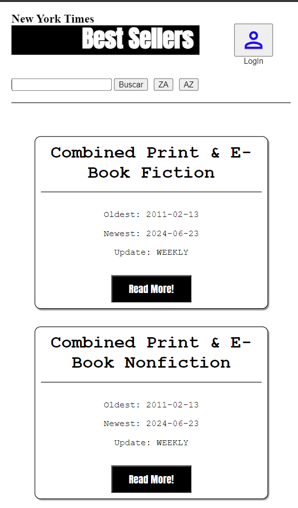
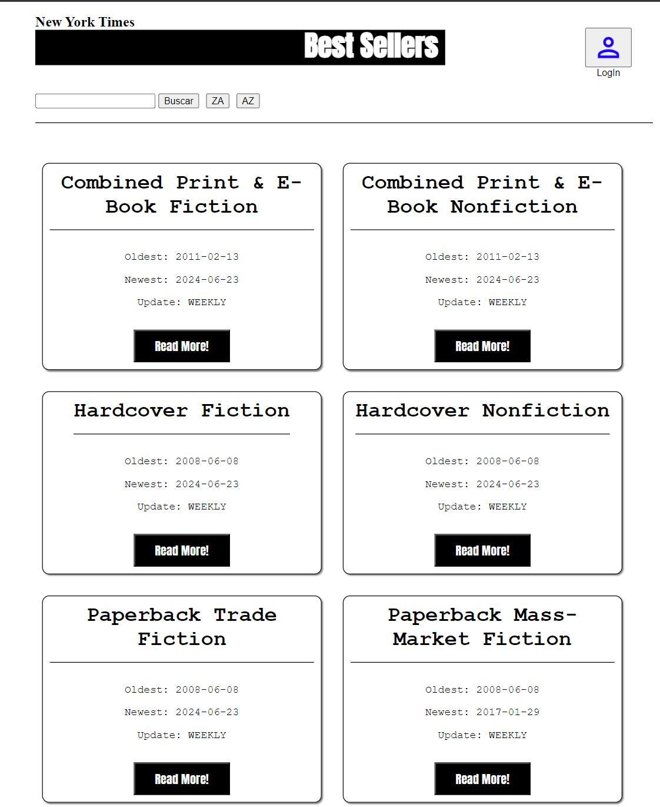
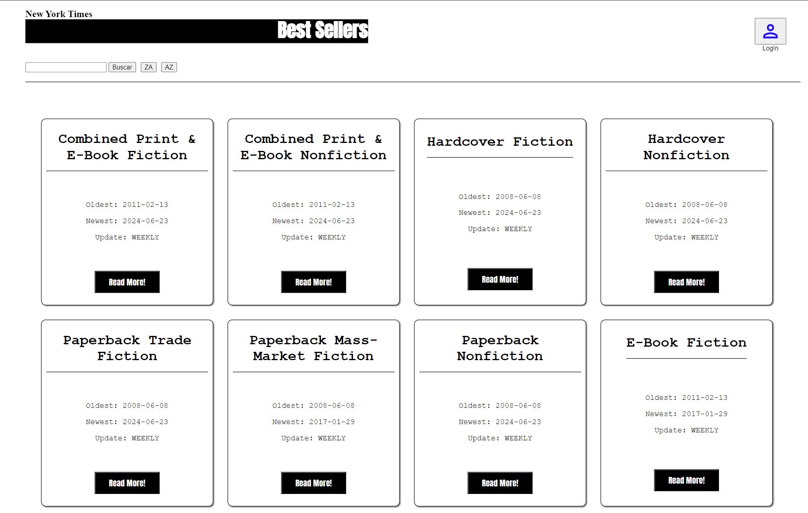
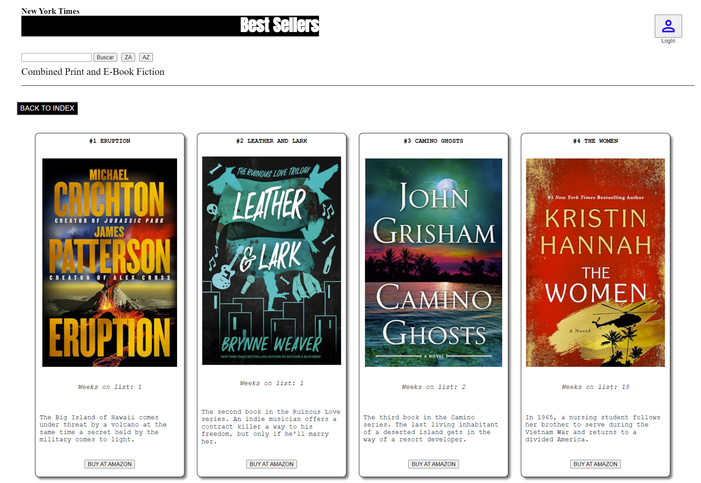
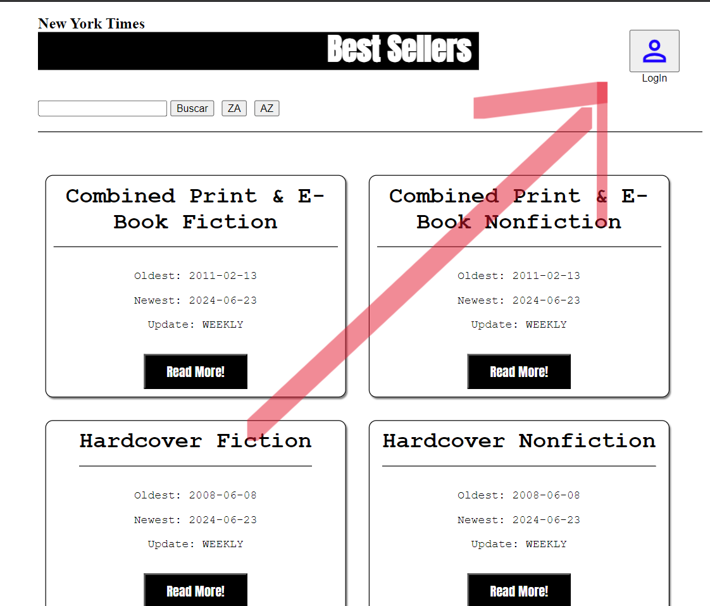

# BibliotecaTimes

En este link puedes encontrar este proyecto en Github Pages : https://rruanom.github.io/BibliotecaTimes/

Antes de nada, el repositorio que estas visitando tiene DISEÑO RESPONSIVE, es deci, el contenido se optimizará al ancho de la pantalla desde el que lo visitas:

Este proyecto, hace una llamada a la [API del NYTimes](https://developer.nytimes.com/apis)

En la pantalla principal, como se ha podido ver, encontraremos todas las categorias, con un titulo, datos que reflejan la fecha mas reciente en la que se añadio un libro y la mas antigua asi como su frecuencia de actualizacion. A través del boton "Read More!" podemos entrar dentro de la categoria elegida y ver los libros que pertenecen a esa lista y se nos colocara el nombre de dicha lista en la cabecera.

Ademas de la informacion del libro, tendremos un boton que nos lleva directamente a la URL de amazon donde podremos adquirirlo. 

Dentro de la aplicación, tenemos implementado un modulo de autenticación ligado a [FIREBASE](https://firebase.google.com), la platafoma de almacenamiento gratuita de Google.
En esta aplicacion contamos con una base de datos, un sistema de autenticacion y una cloudbase para la imagenes.

Para entrar en esta funcionalidad debemos clicar en el icono de perfil en la esquina superior derecha de la pantalla. 